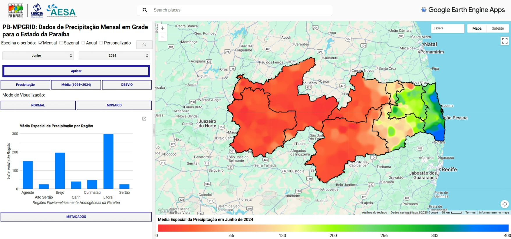

# 🌎 PB-MPGRID App – Visualização e Download de Dados

Este aplicativo foi desenvolvido na plataforma **Google Earth Engine (GEE)** como parte do projeto **PB-MPGRID – Dados de Precipitação Mensal em Grade para o Estado da Paraíba**.  

🔗 **Acesse o App aqui:** [PB-MPGRID App](https://edivansilva.projects.earthengine.app/view/pb-mpgrid)  

## 📌 Funcionalidades

O App permite **visualizar** e **baixar** dados em formato **TIFF** de diferentes produtos derivados do PB-MPGRID:

- ✅ **Precipitação mensal** – mapas para cada mês da série histórica.  
- ✅ **Climatologia** – médias mensais de referência.  
- ✅ **Desvios de precipitação** – comparação entre um mês específico e a climatologia.  
- ✅ **Mosaico de chuvas** – visão espacial integrada da precipitação no estado.  

## 📸 Prévia do App

## 📥 Download de Dados

Além da visualização, o App permite exportar os dados diretamente em formato **GeoTIFF**, facilitando a integração com softwares de SIG como **QGIS** e **ArcGIS**.

## 📖 Como citar

Se utilizar este aplicativo ou os dados nele disponibilizados em trabalhos acadêmicos ou técnicos, cite como:

DOS SANTOS, E. S.; SILVA, B. B.; BRAGA, C. C.  **PB-MPGRID: Dados de Precipitação Mensal em Grade para o Estado da Paraíba** – Aplicativo no Google Earth Engine.  Disponível em: [https://edivansilva.projects.earthengine.app/view/pb-mpgrid](https://edivansilva.projects.earthengine.app/view/pb-mpgrid).

---

